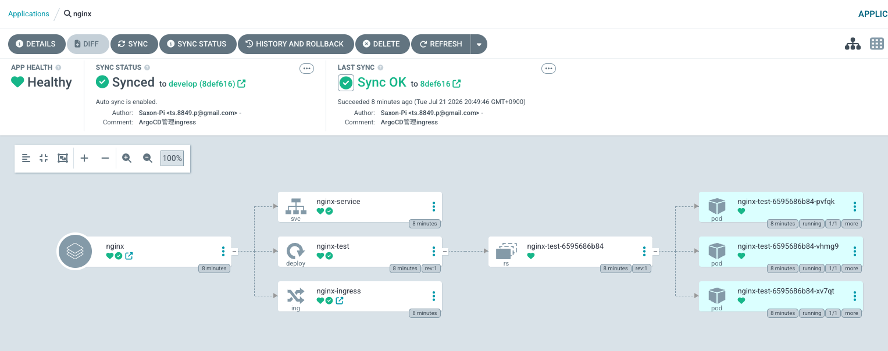
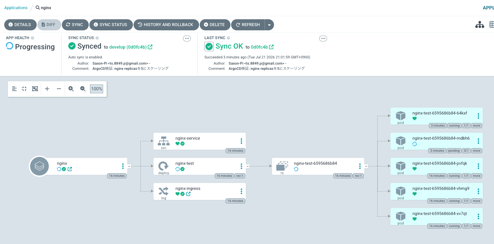

# Argo CD ハンズオン（GitOps）

## 概要

Argo CD を Amazon EKS へ導入し、  
GitHub Repository を Single Source of Truth とした GitOps 環境を構築した

これにより、GitHub の Kubernetes Manifest を監視し、  
Git の変更が自動的に Kubernetes Cluster へ反映されることを確認した

---

# アーキテクチャ

```text
Git Push
    │
    ▼
GitHub Repository (develop)
    │
    ▼
Argo CD Server
    │
Gitとの差分を監視
    │
    ▼
Kubernetes API Server
    │
    ▼
Deployment / Service / Ingress 更新
    │
    ▼
ReplicaSet 更新
    │
    ▼
Pod 作成
```

---

# 使用した構成

```
k8s
├── apps
│   └── nginx
│       ├── deployment.yaml
│       ├── service.yaml
│       └── ingress.yaml
│
└── argocd
    └── nginx-application.yaml
```

---

# CDK

Argo CD は AWS CDK の Helm Chart としてデプロイした

```ts
cluster.addHelmChart("ArgoCd", {
    release: "argocd",
    chart: "argo-cd",
    repository: "https://argoproj.github.io/argo-helm",
    namespace: "argocd",
});
```

AWS Load Balancer Controller も CDK 管理へ変更した

```text
CDK Deploy
↓
Argo CD
AWS Load Balancer Controller
↓
ALB 自動作成
```

---

# Argo CD へのアクセス

Ingress を作成

```yaml
apiVersion: networking.k8s.io/v1
kind: Ingress

metadata:
  name: argocd-ingress

spec:
  ingressClassName: alb
```

これにより、AWS Load Balancer Controller が、  
Argo CD にアクセスするための ALB を自動作成する

確認方法

```bash
kubectl get ingress -n argocd
```

```
NAME             ADDRESS
argocd-ingress   xxxxx.ap-northeast-1.elb.amazonaws.com
```

ブラウザからアクセスすると、Argo CD に接続できる

```
http://<ALB DNS>
```

---

# 初回ログイン

ユーザー

```
admin
```

パスワードの取得

```bash
kubectl -n argocd get secret argocd-initial-admin-secret \
-o jsonpath="{.data.password}" \
| base64 --decode
```

---

# Application 作成

```bash
kubectl apply -f k8s/argocd/nginx-application.yaml
```

確認方法

```bash
kubectl get applications -n argocd
```

```
NAME
nginx
```

---

# GitOps 動作確認

GitHub の Deployment を変更して動作を確認する

変更前の Pod 台数は以下となる

```yaml
replicas: 3
```



↓

以下に変更する

```yaml
replicas: 5
```

Git Push

```bash
git add .
git commit -m "Scale nginx"
git push origin develop
```

Argo CD が差分を検知

```
GitHub
    │
    ▼
Argo CD
    │
Deployment 更新
    │
ReplicaSet 更新
    │
Pod 作成
```

Deployment 確認

```bash
kubectl get deployment nginx-test -w
```

```
READY
3/5
4/5
```

Argo CD 上でも Pod 台数が増加していることを確認できる  
（5台のうち 1台は Pending 状態）



---

# Pod が Pending になった原因

5台目は起動できなかった

```bash
kubectl describe pod <pod-name>
```

```
0/1 nodes are available:
1 Too many pods
```

Node の Capacity 台数は以下となっていた

```text
Capacity

pods: 17
```

Node 上の Pod 台数は以下となっていた

```
argocd        7 Pods
default       4 Pods
kube-system   6 Pods

合計 17 Pods
```

Node の Pod 上限へ到達したため、
5台目は Pending となっていた

```text
Deployment
    │
replicas=5
    │
ReplicaSet
    │
Pod ×5
    │
Scheduler
    │
┌───────────────┐
│17 Pods配置済み │
└───────────────┘
        │
        ▼
Pending
```

---

# 学んだこと

## Argo CD の役割

Argo CD は Kubernetes Resource の Desired State を Git Repository と比較し、  
差分があれば Kubernetes API を通して自動反映する

Argo CD は Pod を直接操作するのではなく、

```
Deployment
↓
ReplicaSet
↓
Scheduler
↓
Pod
```

という Kubernetes 本来の仕組みを利用してデプロイを行う

---

## Repositories と Applications の違い

Argo CD 上の Repository は GitHub Repository を指し、

Application は

- Repository
- Branch
- Path

を紐付けた GitOps の管理単位を指している

今回は

```
Repository
https://github.com/Saxon-Pi/eks-karpenter-spot-lab

Branch
develop

Path
k8s/apps/nginx
```

を監視対象とした

---

## GitOps の流れ

```
Developer
↓
Git Push
↓
GitHub
↓
Argo CD
↓
Deployment 更新
↓
ReplicaSet
↓
Pod
↓
Application Running
```

---

# 今後の課題

- Self Heal の検証
- Prune の検証
- Karpenter と連携し、Pending Pod から Node が自動追加されることを確認
- Application の App of Apps 構成
- Helm Repository の GitOps 管理

---
